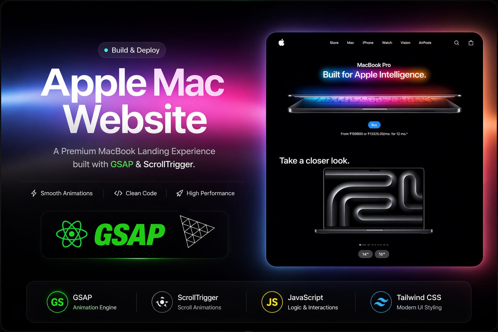

<h1 align="center">  MacBook Landing Experience</h1>

  

  <b>Apple-level product storytelling with high-performance animations & immersive UI.</b>

  🚀 Built for <b>MNC-level Frontend Engineering Standards</b>

---

🧠 About The Project

This project is a high-end MacBook landing page experience inspired by Apple's official website.
The goal is not just design — but to demonstrate real-world frontend engineering skills like:

- Performance-focused animations
- Smooth scroll-based storytelling
- Scalable component architecture
- Production-level UI/UX

---

✨ Core Features

- 🎯 Scroll-driven storytelling (Apple-style transitions)
- ⚡ 60fps smooth animations powered by GSAP
- 🎬 Integrated video sections for product experience
- 💎 Pixel-perfect premium UI
- 📱 Fully responsive across all devices
- 🧩 Clean and reusable component structure
- 🚀 Optimized asset loading for performance

---

🌐 Live Demo

 

 <a href="https://mackbook-by-nishh.vercel.app" target="_blank">
   
</a

 

## ⚙️ Tech Stack

---

GSAP is used as the core animation engine to drive all motion in this landing page.  
It powers smooth MacBook transitions, text reveals, and section-based animations.  
Timelines are structured to ensure consistent animation flow across sections.  
Optimized rendering prevents frame drops during heavy UI motion.  
This enables a high-performance, Apple-level cinematic user experience.

---

ScrollTrigger is used to synchronize animations with scroll behavior.  
It controls pinned sections where the MacBook stays fixed during transitions.  
Scroll-based timelines create a storytelling effect across the page.  
Precise control ensures smooth and predictable interactions.  
This replicates modern product showcase experiences used by leading tech companies.

---

JavaScript manages all animation logic and interaction flow in the project.  
It handles scroll events, timeline triggers, and dynamic UI updates.  
The code is structured to support modular and scalable animation systems.  
It ensures smooth coordination between UI elements and animations.  
This forms the backbone of the interactive landing experience.

---

Tailwind CSS is used to design a clean and responsive Apple-style interface.  
It enables rapid UI development with consistent spacing and typography.  
Utility classes reduce CSS complexity and improve maintainability.  
Responsive design ensures proper layout across all screen sizes.  
This results in a polished, modern, and performance-optimized UI.

---

Three.js is used to enhance visual depth with 3D-like product presentation.  
It allows rendering of interactive elements and perspective-based visuals.  
Camera and lighting controls improve realism of the MacBook showcase.  
It integrates with GSAP for smooth animated transitions.  
This adds a next-generation immersive layer to the landing page.

---

Vite is used as the build tool for fast development and optimized output.  
It provides instant hot module replacement for real-time feedback.  
Efficient bundling improves load performance in production.  
It handles assets and scripts with minimal configuration.  
This ensures a smooth development workflow and fast deployment.

---

Zustand is used for managing global UI state in the project.  
It controls interactive states like sections, animations, and UI updates.  
Lightweight architecture reduces complexity and boilerplate.  
Efficient state updates avoid unnecessary re-renders.  
This improves performance and keeps the codebase clean and scalable.

---
🔮 Future Enhancements

- 🧊 Three.js based 3D product interaction
- 🎯 Advanced micro-interactions
- 🌍 SEO & accessibility improvements
- 📊 Performance analytics

